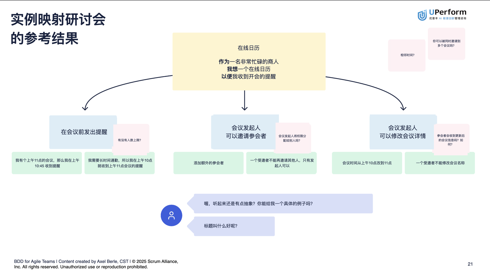
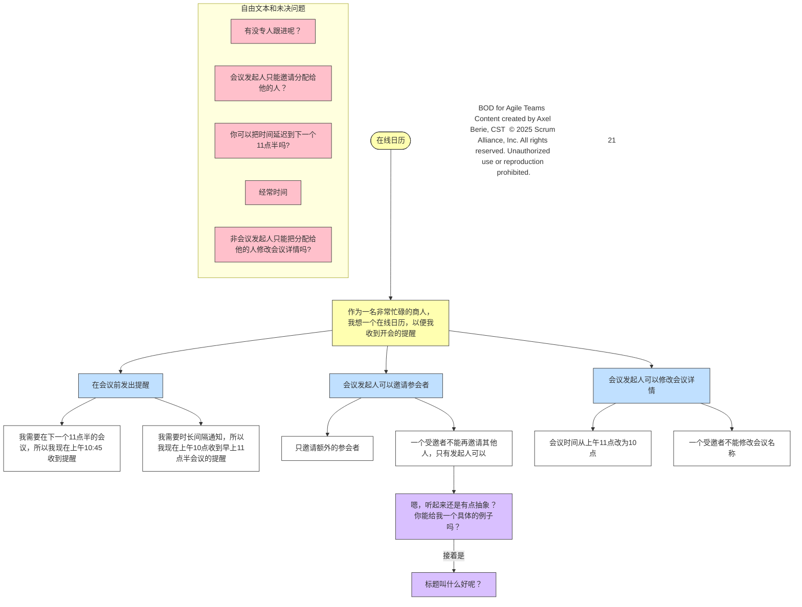
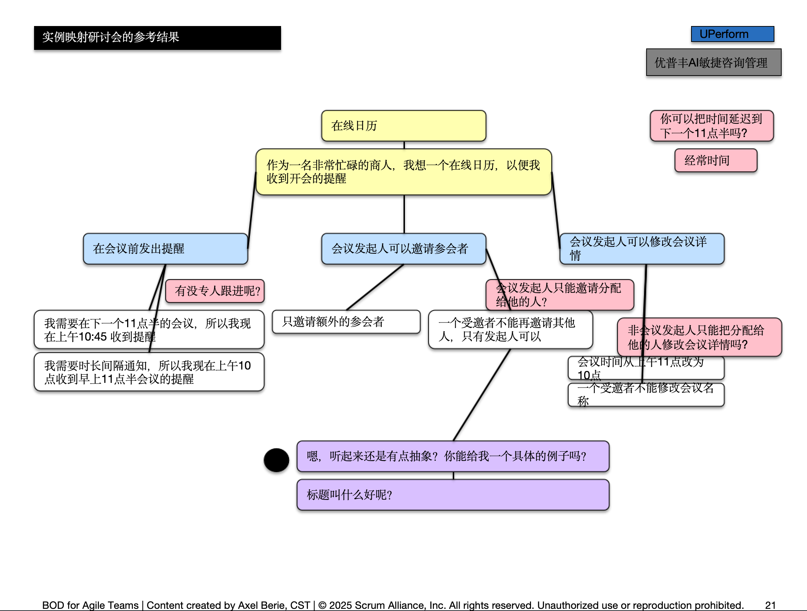

# convert-flowchart-image-to-shapes-in-pptx

## Goal
AI-powered tool to convert flowchart images into editable shapes within PowerPoint (PPtx) presentations.
用AI识别带有流程图形状的图片，导出为可编辑的 powerpoint格式。可用于复刻幻灯片或流程图

## TODO
- [ ] Integrate Recognizing and Generating as a whole script tool

## Setup

```bash
pip install python-pptx==1.0.2
```

## Usage

1. 先用核心提示词[recognize.prompt.md](./recognize.prompt.md)请任一LLM识别图片，输出json格式，保存到目录下`diagram_data.json`中
2. 再调用训练好的脚本.
   
```bash
python create_diagram-v2.0.py
```

3. （可选）你还可以用LLM输出的mermaid来观察识别的结果是否符合要求。

## Example

- Original Image 

- Recognized shapes 



- Generated Powerpoint file (snapshot)


## 🎯 Features

1. **智能连接**: 根据形状相对位置自动选择最美观的连接点
2. **垂直优先**: 当两个元素主要是上下关系时，自动连接上方元素底部和下方元素顶部
3. **水平对齐**: 左右关系时选择合适的侧面连接点
4. **对角处理**: 对角关系时选择主导方向进行连接
5. **兼容性强**: 完全兼容python-pptx 1.0.2环境

现在运行代码时，您将看到每个连接的详细分析过程，包括：

- 📍 两个元素的精确中心点坐标
- 📏 X、Y方向距离和总距离
- 🔄 重叠和对齐情况
- 🎯 识别出的主要位置关系类型
- ✅ 推荐的最优连接点
- 🏆 所有连接方案的评分排序

### 🚀 使用效果

- **更自然的连接**: 连接线路径更符合视觉习惯
- **减少交叉**: 智能避免不必要的线条交叉
- **一致性**: 相似位置关系的元素使用一致的连接策略
- **稳定性**: 增强了错误处理和边界情况的处理

### 🏆 **智能决策逻辑**

- **重叠优先**: X轴或Y轴重叠时，优选对应方向的连接
- **对齐检测**: 精确检测中心点对齐情况
- **方向主导**: 通过比率判断主要方向关系
- **美观度评分**: 综合考虑距离、角度、方向一致性

### 🔧 核心优化点

#### 1. **智能连接点选择算法**

- **增强版连接点选择**: 新增 `get_smart_connection_points_enhanced()` 函数，通过计算所有可能连接组合的"美观度分数"来选择最优连接
- **多策略连接逻辑**: 优先考虑垂直关系，然后是水平关系，最后处理对角关系
- **重叠检测**: 检测形状是否存在X/Y轴重叠，调整连接策略

#### 2. **美观度评分系统**

- **连接线长度**: 优选最短路径
- **角度偏好**: 水平线和垂直线得分更高（更美观）
- **方向一致性**: 连接方向与整体位置关系一致时给予奖励
- **避免交叉**: 减少连接线交叉的可能性

#### 3. **改进的容错机制**

- **动态容错范围**: 分别设置X轴和Y轴的对齐容错范围
- **最小距离阈值**: 跳过距离过近的连接，避免重叠元素的连接问题
- **错误处理**: 完善的异常处理和日志输出

#### 4. **代码结构优化**

- **模块化设计**: 将复杂逻辑拆分为独立函数
- **更好的可读性**: 添加详细注释和类型说明
- **性能优化**: 减少重复计算，缓存形状边界信息

